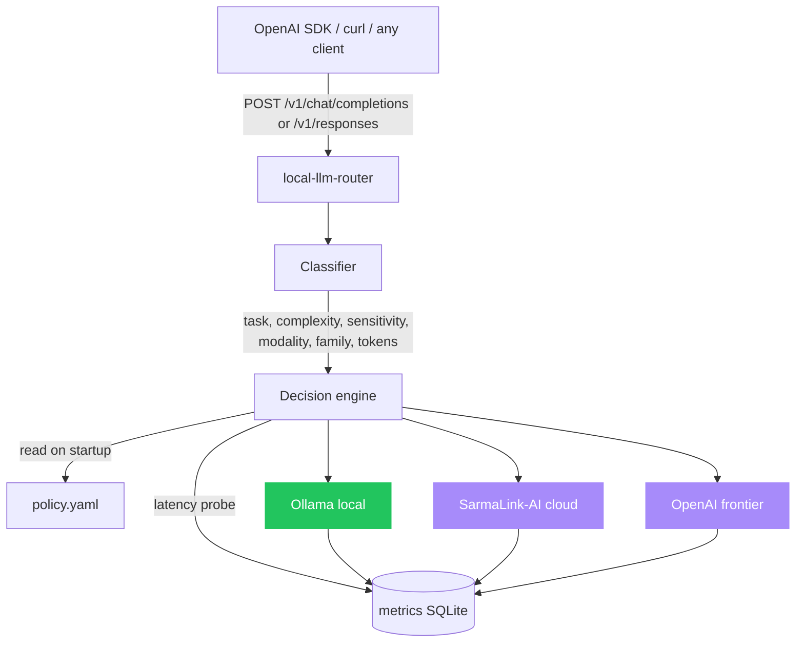
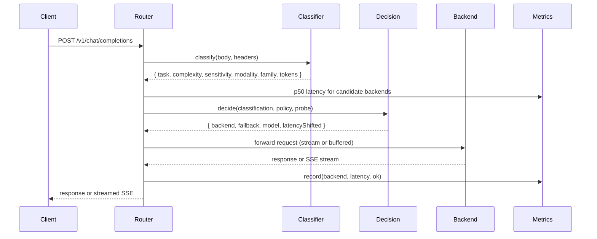

# Architecture

local-llm-router is a stateless OpenAI-compatible proxy. A request arrives, the
router classifies it, decides which backend should serve it, dispatches, and
records the outcome. The only persistent state is the metrics database.

## Request flow

## Components

| File | Responsibility |
|---|---|
| `src/index.ts` | Hono server, OpenAI-compatible routes, streaming, Responses API, metrics endpoints |
| `src/routing/classifier.ts` | Heuristic classification: task, complexity, sensitivity, modality, model family |
| `src/routing/decision.ts` | Walks the policy, applies the latency budget, resolves the concrete model |
| `src/routing/responses.ts` | Translation between the Responses API shape and chat completions |
| `src/config/loader.ts` | YAML policy parsing and validation (Zod) |
| `src/backends/registry.ts` | Dispatches to a backend, returns buffered JSON or a stream |
| `src/backends/ollama.ts` | Local Ollama backend, OpenAI-compatible, streaming |
| `src/backends/sarmalink.ts` | SarmaLink-AI hosted backend |
| `src/backends/openai.ts` | OpenAI frontier backend, also any OpenAI-compatible provider |
| `src/metrics/collector.ts` | `node:sqlite` metrics, p50 probe, Prometheus export |
| `src/metrics/ab.ts` | Rolling A/B: shadow sampling and promotion recommendations |

## The four stages

1. **Classify.** A cheap, deterministic heuristic inspects the last user message
   and emits a tag set: task type (code, web search, summarisation,
   classification, vision, general), complexity (low, medium, high from token
   count), sensitivity (from the `X-LLR-Sensitivity` header), modality (text or
   image), an open-weight model family, and an estimated token count. No model
   call, no network hop.
2. **Decide.** The decision engine walks the policy routes top to bottom and
   returns the first match. The route names a primary backend and an optional
   fallback, and the engine resolves the classifier's family to a concrete
   model from the backend's `families` map. If the route sets a latency budget
   and the primary is expected to miss it, the request shifts to the fallback.
3. **Dispatch.** The registry calls the chosen provider. Buffered requests
   return parsed JSON; streaming requests pass the backend's native SSE straight
   through. On error the router transparently retries the fallback backend.
4. **Record.** Every attempt writes backend, latency, success, and any fallback
   to SQLite for per-route reporting, the latency-budget probe, and rolling A/B.

## Design choices

**Heuristic classifier, not a model.** A regex-based classifier is sub-millisecond,
deterministic, and good enough for the rough buckets the policy needs. Swap in a
tiny on-device classifier later if you outgrow it.

**Hono, not Express.** Smaller, faster, the same OpenAI-compatible surface, and
edge-deployable.

**`node:sqlite`, not a native module.** The metrics store uses Node's built-in
SQLite, so there is no native module to compile or ship a prebuilt for. Promote
to Postgres if you need cross-instance metrics.

**YAML policy.** Engineers without TypeScript can edit it and operators can
review it as a single file. It is validated with Zod at startup, so a malformed
file fails fast rather than at request time.
