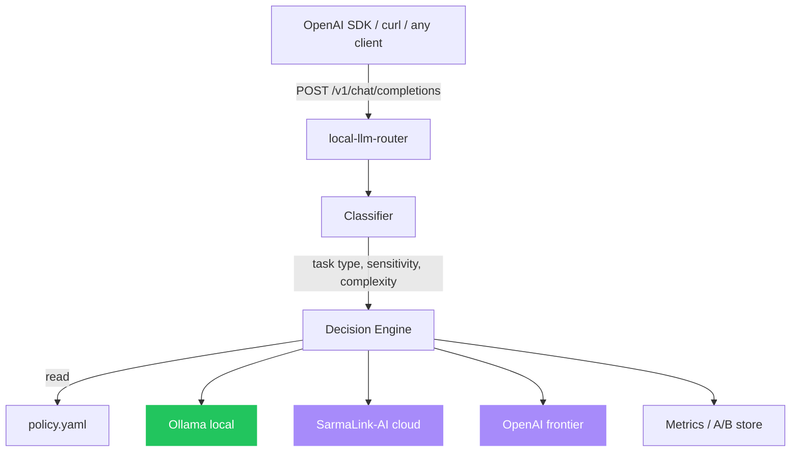

# local-llm-router

[](LICENSE)
[](https://github.com/sarmakska/local-llm-router)
[](https://github.com/sarmakska/local-llm-router/commits/main)
[](https://ollama.com)
[](https://platform.openai.com)

**Route every prompt to the cheapest model that can do the job. Local first, cloud when needed.**

Built by [Sarma Linux](https://sarmalinux.com).

---

## What this is

A drop-in OpenAI-compatible proxy. Your client points at `local-llm-router` instead of OpenAI. The router classifies the request, applies your declarative YAML policy, and decides whether to send it to a local Ollama model, hosted SarmaLink-AI, or a frontier provider.

The economics of LLM apps reward routing. A small local model handles the bulk of trivial traffic for free. A mid-tier hosted model handles common cases. Frontier models handle the hard slice. The trick is deciding which is which without a human in the loop. This is that.

## Architecture



## Quick start

```bash
git clone https://github.com/sarmakska/local-llm-router.git
cd local-llm-router
pnpm install
cp .env.example .env
cp policy.example.yaml policy.yaml
pnpm dev
```

Point any OpenAI client at `http://localhost:3030/v1`:

```python
from openai import OpenAI
client = OpenAI(base_url="http://localhost:3030/v1", api_key="anything")
response = client.chat.completions.create(model="auto", messages=[{"role": "user", "content": "hi"}])
```

The router picks the actual backend.

The full guide lives in the [project wiki](https://github.com/sarmakska/local-llm-router/wiki).

## What is in the box

- An OpenAI-compatible HTTP server (`/v1/chat/completions`) built on Hono.
- A deterministic classifier that tags each request with task type, complexity, sensitivity, and an estimated token count, with no extra model call.
- A decision engine that walks your YAML policy top to bottom and resolves every request to a backend, with optional per-route fallback.
- Three backends out of the box: Ollama (local), SarmaLink-AI (cloud), and OpenAI (frontier). A registry pattern makes a new backend roughly sixty lines.
- A SQLite metrics collector recording per-route latency, success, token cost, and fallback rate, plus a rolling A/B loop that promotes cheaper routes and rolls back on quality drops.
- A `policy.example.yaml` to copy, a Dockerfile, and a typed configuration loader validated with Zod at startup.

## When to use this / when not to

Use this when you run Ollama locally and want automatic cloud fallback, when you want to cut LLM spend by sending trivial traffic to cheap models without touching application code, or when regulated prompts must stay on the local network while general traffic still reaches the cloud. Any existing OpenAI client works unchanged: point it at the router and set `model: "auto"`.

Do not use this if you only ever call a single model, since the routing layer buys you nothing. It is also not a general API gateway: there is no auth, rate limiting, or billing built in, so put it behind your own ingress for those concerns. If you need a hosted multi-provider gateway with failover and plugins rather than a self-hosted local-first router, reach for [Sarmalink-ai](https://github.com/sarmakska/Sarmalink-ai) instead.

## Policy DSL

```yaml
backends:
  local: { type: ollama, endpoint: http://localhost:11434, models: [llama3.2:3b, qwen2.5-coder:7b] }
  sarmalink: { type: sarmalink, endpoint: https://api.sarmalink.ai/v1, model: smart }
  frontier: { type: openai, model: gpt-4o }

routes:
  - match: { sensitivity: high }
    backend: local
    reason: "Privacy pin: never leave the machine"

  - match: { task: code, complexity: low }
    backend: local
    fallback: sarmalink

  - match: { task: code, complexity: high }
    backend: frontier

  - match: { task: web_search }
    backend: sarmalink

  - default: sarmalink
    fallback: frontier
```

## Configuration

| Env var | Purpose | Default |
|---|---|---|
| `LLR_PORT` | server port | `3030` |
| `LLR_POLICY` | policy file path | `./policy.yaml` |
| `LLR_DB` | metrics SQLite path | `./metrics.db` |
| `OPENAI_API_KEY` | frontier backend | unset |
| `SARMALINK_API_KEY` | SarmaLink backend | unset |
| `OLLAMA_URL` | local Ollama URL | `http://localhost:11434` |

## Privacy pinning

Mark requests as sensitive in client headers (`X-LLR-Sensitivity: high`) or in policy by tenant. Sensitive requests never leave the local network.

## Metrics + rolling A/B

Per-route success, latency, and token cost stored in SQLite. The router occasionally promotes cheaper routes to a small percentage of traffic and observes downstream scorer feedback. Quality drops trigger automatic rollback.

## Deployment

```bash
docker build -t local-llm-router .
docker run -p 3030:3030 \
  -v $(pwd)/policy.yaml:/app/policy.yaml \
  -e SARMALINK_API_KEY=... \
  local-llm-router
```

For local development, just run `pnpm dev` alongside an Ollama instance.

## Roadmap

- [x] OpenAI-compatible chat completions
- [x] Ollama / SarmaLink / OpenAI backends
- [x] YAML policy
- [x] Privacy pinning
- [x] SQLite metrics
- [ ] Embeddings endpoint
- [ ] Hugging Face Inference API backend
- [ ] vLLM backend for self-hosted GPU
- [ ] Prometheus metrics export
- [ ] Web dashboard for route stats

## License

MIT.

Built by [Sarma Linux](https://sarmalinux.com).


---

## More open source by Sarma

Part of a portfolio of twelve production-shaped open-source repositories built and maintained by [Sarma](https://sarmalinux.com).

| Repository | What it is |
|---|---|
| [Sarmalink-ai](https://github.com/sarmakska/Sarmalink-ai) | Multi-provider OpenAI-compatible AI gateway with 14-engine failover and intent-based plugin auto-routing |
| [agent-orchestrator](https://github.com/sarmakska/agent-orchestrator) | Durable multi-agent workflows in TypeScript with deterministic replay and Inspector UI |
| [voice-agent-starter](https://github.com/sarmakska/voice-agent-starter) | Sub-second full-duplex voice agent loop. WebRTC, mediasoup, pluggable STT / LLM / TTS |
| [ai-eval-runner](https://github.com/sarmakska/ai-eval-runner) | Evals as code. Python, DuckDB, FastAPI viewer, regression mode for CI |
| [mcp-server-toolkit](https://github.com/sarmakska/mcp-server-toolkit) | Production Model Context Protocol server starter (Python / FastAPI) |
| [local-llm-router](https://github.com/sarmakska/local-llm-router) | OpenAI-compatible proxy that routes to Ollama or cloud providers based on policy |
| [rag-over-pdf](https://github.com/sarmakska/rag-over-pdf) | Minimal end-to-end RAG starter for PDF corpora |
| [receipt-scanner](https://github.com/sarmakska/receipt-scanner) | Vision OCR for receipts with Zod-validated JSON output |
| [webhook-to-email](https://github.com/sarmakska/webhook-to-email) | Webhook receiver that forwards events to email via Resend |
| [k8s-ops-toolkit](https://github.com/sarmakska/k8s-ops-toolkit) | Helm chart for shipping Next.js to Kubernetes with full observability stack |
| [terraform-stack](https://github.com/sarmakska/terraform-stack) | Vercel + Supabase + Cloudflare + DigitalOcean modules in one Terraform repo |
| [staff-portal](https://github.com/sarmakska/staff-portal) | Open-source HR / ops portal for leave, attendance, expenses, kiosk mode |

Engineering essays at [sarmalinux.com/blog](https://sarmalinux.com/blog) &middot; All projects at [sarmalinux.com/open-source](https://sarmalinux.com/open-source)
