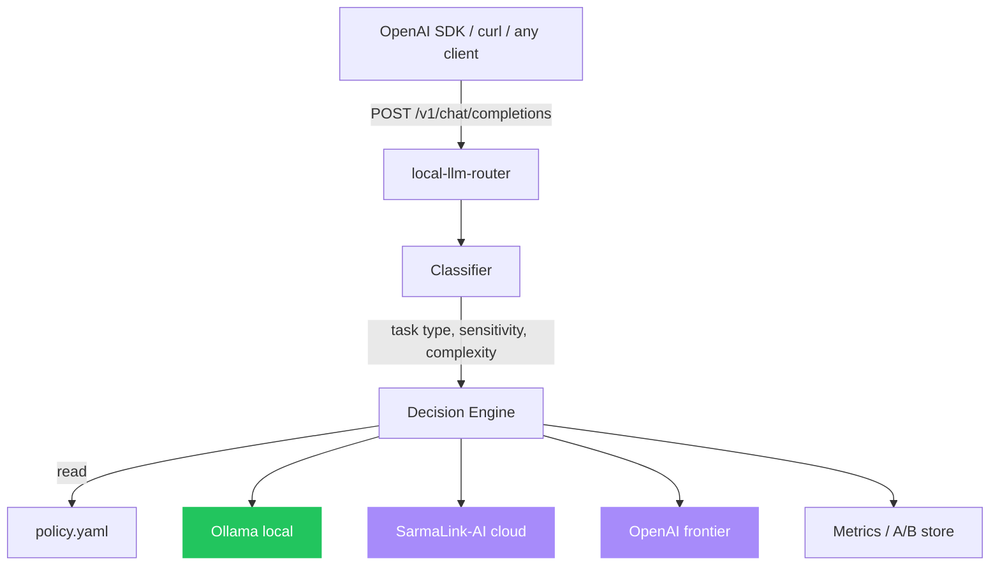

# local-llm-router

[](https://opensource.org/licenses/MIT)
[](https://nodejs.org)
[](https://typescriptlang.org)
[](https://hono.dev)
[](https://ollama.com)
[](https://platform.openai.com)
[](https://github.com/sarmakska/local-llm-router)

**Route every prompt to the cheapest model that can do the job. Local first, cloud when needed.**

Built by [Sarma Linux](https://sarmalinux.com).

---

## What this is

A drop-in OpenAI-compatible proxy. Your client points at `local-llm-router` instead of OpenAI. The router classifies the request, applies your declarative YAML policy, and decides whether to send it to a local Ollama model, hosted SarmaLink-AI, or a frontier provider.

The economics of LLM apps reward routing. A small local model handles the bulk of trivial traffic for free. A mid-tier hosted model handles common cases. Frontier models handle the hard slice. The trick is deciding which is which without a human in the loop. This is that.

## Architecture



## Quick start

```bash
git clone https://github.com/sarmakska/local-llm-router.git
cd local-llm-router
pnpm install
cp .env.example .env
cp policy.example.yaml policy.yaml
pnpm dev
```

Point any OpenAI client at `http://localhost:3030/v1`:

```python
from openai import OpenAI
client = OpenAI(base_url="http://localhost:3030/v1", api_key="anything")
response = client.chat.completions.create(model="auto", messages=[{"role": "user", "content": "hi"}])
```

The router picks the actual backend.

## Policy DSL

```yaml
backends:
  local: { type: ollama, endpoint: http://localhost:11434, models: [llama3.2:3b, qwen2.5-coder:7b] }
  sarmalink: { type: sarmalink, endpoint: https://api.sarmalink.ai/v1, model: smart }
  frontier: { type: openai, model: gpt-4o }

routes:
  - match: { sensitivity: high }
    backend: local
    reason: "Privacy pin: never leave the machine"

  - match: { task: code, complexity: low }
    backend: local
    fallback: sarmalink

  - match: { task: code, complexity: high }
    backend: frontier

  - match: { task: web_search }
    backend: sarmalink

  - default: sarmalink
    fallback: frontier
```

## Configuration

| Env var | Purpose | Default |
|---|---|---|
| `LLR_PORT` | server port | `3030` |
| `LLR_POLICY` | policy file path | `./policy.yaml` |
| `LLR_DB` | metrics SQLite path | `./metrics.db` |
| `OPENAI_API_KEY` | frontier backend | unset |
| `SARMALINK_API_KEY` | SarmaLink backend | unset |
| `OLLAMA_URL` | local Ollama URL | `http://localhost:11434` |

## Privacy pinning

Mark requests as sensitive in client headers (`X-LLR-Sensitivity: high`) or in policy by tenant. Sensitive requests never leave the local network.

## Metrics + rolling A/B

Per-route success, latency, and token cost stored in SQLite. The router occasionally promotes cheaper routes to a small percentage of traffic and observes downstream scorer feedback. Quality drops trigger automatic rollback.

## Deployment

```bash
docker build -t local-llm-router .
docker run -p 3030:3030 \
  -v $(pwd)/policy.yaml:/app/policy.yaml \
  -e SARMALINK_API_KEY=... \
  local-llm-router
```

For local development, just run `pnpm dev` alongside an Ollama instance.

## Roadmap

- [x] OpenAI-compatible chat completions
- [x] Ollama / SarmaLink / OpenAI backends
- [x] YAML policy
- [x] Privacy pinning
- [x] SQLite metrics
- [ ] Embeddings endpoint
- [ ] Hugging Face Inference API backend
- [ ] vLLM backend for self-hosted GPU
- [ ] Prometheus metrics export
- [ ] Web dashboard for route stats

## License

MIT.

Built by [Sarma Linux](https://sarmalinux.com).
