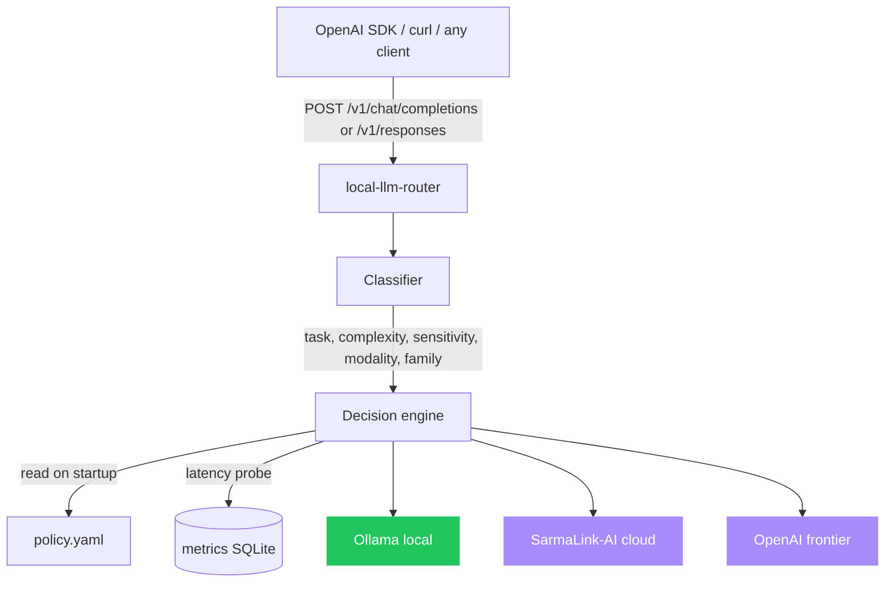

# local-llm-router

[](LICENSE)
[](https://github.com/sarmakska/local-llm-router)
[](https://github.com/sarmakska/local-llm-router/commits/main)
[](https://ollama.com)
[](https://platform.openai.com)

**Route every prompt to the cheapest model that can do the job. Local first, cloud when needed.**

A drop-in OpenAI-compatible proxy that classifies each request, applies your declarative YAML policy, and dispatches to a local Ollama model, hosted SarmaLink-AI, or a frontier provider. It speaks both Chat Completions and the Responses API, streams natively, and resolves model families (Qwen 2.5 Coder, Gemma 3, Llama 4) so one policy drives your whole fleet. When the local model is too slow for a route's latency budget, it spills to the cloud automatically.

Built by [Sarma Linux](https://sarmalinux.com).

---

## Architecture



## Quick start

```bash
git clone https://github.com/sarmakska/local-llm-router.git
cd local-llm-router
pnpm install
cp policy.example.yaml policy.yaml
pnpm dev
```

Point any OpenAI client at `http://localhost:3030/v1`:

```python
from openai import OpenAI
client = OpenAI(base_url="http://localhost:3030/v1", api_key="anything")
response = client.chat.completions.create(model="auto", messages=[{"role": "user", "content": "hi"}])
```

Set `model: "auto"` and the router picks the backend and the concrete model. The
full guide lives in the [project wiki](https://github.com/sarmakska/local-llm-router/wiki).

## What is in the box

- An OpenAI-compatible HTTP server built on Hono, serving `/v1/chat/completions`
  and the Responses API at `/v1/responses`, with native streaming on both.
- A deterministic classifier that tags each request with task type, complexity,
  sensitivity, modality, an open-weight model family, and an estimated token
  count, with no extra model call.
- A decision engine that walks your YAML policy top to bottom, resolves the
  family to a concrete model (Qwen 2.5 Coder for code, Gemma 3 for vision,
  Llama 4 for general work), and honours per-route latency budgets and fallback.
- Three backends out of the box: Ollama (local), SarmaLink-AI (cloud), and
  OpenAI (frontier). A registry pattern makes a new backend roughly sixty lines.
- A metrics store on Node's built-in `node:sqlite` recording per-route latency,
  success, and fallback rate, exposed as JSON at `/v1/metrics` and Prometheus
  text at `/metrics`, including an approximate p95 per backend. The `hours`
  window param is sanitised, so a malformed or hostile value cannot poison the
  query.
- A rolling A/B loop that mirrors a sample of traffic to a candidate backend in
  the background and recommends promotions from real production latency. The
  promotion gate is tail-aware: a candidate only earns `promote` when its p95 is
  no worse than the primary's, so a backend that wins on the average but loses on
  the tail is held rather than promoted into an interactive path.
- A `policy.example.yaml` to copy, a Dockerfile, and a typed configuration
  loader validated with Zod at startup.

## When to use this / when not to

Use this when you run Ollama locally and want automatic cloud fallback, when you
want to cut LLM spend by sending trivial traffic to cheap models without touching
application code, or when regulated prompts must stay on the local network while
general traffic still reaches the cloud. Any existing OpenAI client works
unchanged: point it at the router and set `model: "auto"`.

Do not use this if you only ever call a single model, since the routing layer
buys you nothing. It is also not a general API gateway: there is no auth, rate
limiting, or billing built in, so put it behind your own ingress for those
concerns. If you need a hosted multi-provider gateway with failover and plugins
rather than a self-hosted local-first router, reach for
[Sarmalink-ai](https://github.com/sarmakska/Sarmalink-ai) instead.

## Policy DSL

```yaml
backends:
  local:
    type: ollama
    endpoint: http://localhost:11434
    families:
      qwen-coder: qwen2.5-coder:7b
      gemma: gemma3:12b
      llama: llama4:16x17b
    p50Ms: 1800
  sarmalink: { type: sarmalink, endpoint: https://api.sarmalink.ai/v1, model: smart, p50Ms: 600 }
  frontier: { type: openai, model: gpt-4o, p50Ms: 900 }

routes:
  - match: { sensitivity: high }
    backend: local
    reason: "Privacy: never leave the machine"

  - match: { task: code, complexity: low }
    backend: local
    fallback: sarmalink
    latencyBudgetMs: 2500

  - match: { task: vision }
    backend: local
    fallback: frontier
    latencyBudgetMs: 3000

  - match: { task: web_search }
    backend: sarmalink

  - default: local
    fallback: sarmalink
    latencyBudgetMs: 1200
```

The classifier emits `task`, `complexity`, `sensitivity`, `modality`, `family`,
and `tokens`; a `match` block is a conjunction over any of them. See the
[Policy DSL wiki page](https://github.com/sarmakska/local-llm-router/wiki/Policy-DSL).

## Model families and latency budgets

The classifier picks an open-weight family for each request and the decision
engine resolves it to a concrete model from the chosen backend's `families` map:
code to Qwen 2.5 Coder, image prompts to Gemma 3, everything else to Llama 4. A
route may also set `latencyBudgetMs`. When the primary backend's expected
latency, taken from live metrics or the backend's `p50Ms` hint, exceeds the
budget and the fallback is faster, the request shifts to the fallback so a slow
local model never blows a tight interactive budget.

## Responses API

The router also serves the OpenAI Responses API at `/v1/responses`. It accepts
`input`, `instructions`, and content parts, routes through the same engine and
backends, and returns a Responses envelope with `output`, `output_text`, and
`usage`. Streaming is passed through as the backend's native SSE.

## Configuration

| Env var | Purpose | Default |
|---|---|---|
| `LLR_PORT` | server port | `3030` |
| `LLR_POLICY` | policy file path | `./policy.yaml` |
| `LLR_DB` | metrics SQLite path | `./metrics.db` |
| `OPENAI_API_KEY` | frontier backend | unset |
| `SARMALINK_API_KEY` | SarmaLink backend | unset |

## Metrics and rolling A/B

Per-route success, latency, and fallback rate are stored in SQLite. `GET /v1/metrics`
returns a JSON summary, `GET /metrics` returns Prometheus text with an
`llr_backend_latency_p95_ms` gauge per backend, and `GET /v1/ab` reports which
candidate backends are ready to promote. Each endpoint takes an optional `hours`
window that is clamped to a sane positive range. Enable A/B in policy:

```yaml
ab:
  enabled: true
  sampleRate: 0.05
  candidates:
    local: sarmalink
```

The A/B report compares average and p95 latency for each primary/candidate pair.
A candidate is recommended for promotion only when it matches the primary's
success rate, beats it on average, and is no worse on the tail. Tail latency,
not the average, is what blows an interactive budget, so the gate weighs it
explicitly.

## Deployment

```bash
docker build -t local-llm-router .
docker run -p 3030:3030 \
  -v $(pwd)/policy.yaml:/app/policy.yaml \
  -e SARMALINK_API_KEY=... \
  local-llm-router
```

For local development, run `pnpm dev` alongside an Ollama instance. See the
[Deployment wiki page](https://github.com/sarmakska/local-llm-router/wiki/Deployment).

## Wiki

- [Architecture](https://github.com/sarmakska/local-llm-router/wiki/Architecture)
- [Quick-Start](https://github.com/sarmakska/local-llm-router/wiki/Quick-Start)
- [Policy-DSL](https://github.com/sarmakska/local-llm-router/wiki/Policy-DSL)
- [Backends](https://github.com/sarmakska/local-llm-router/wiki/Backends)
- [Privacy-Pinning](https://github.com/sarmakska/local-llm-router/wiki/Privacy-Pinning)
- [Metrics-and-AB](https://github.com/sarmakska/local-llm-router/wiki/Metrics-and-AB)
- [Deployment](https://github.com/sarmakska/local-llm-router/wiki/Deployment)
- [Roadmap](https://github.com/sarmakska/local-llm-router/wiki/Roadmap)

## License

MIT. Built by [Sarma Linux](https://sarmalinux.com).

---

## More open source by Sarma

Part of a portfolio of twelve production-shaped open-source repositories built and maintained by [Sarma](https://sarmalinux.com).

| Repository | What it is |
|---|---|
| [Sarmalink-ai](https://github.com/sarmakska/Sarmalink-ai) | Multi-provider OpenAI-compatible AI gateway with 14-engine failover and intent-based plugin auto-routing |
| [agent-orchestrator](https://github.com/sarmakska/agent-orchestrator) | Durable multi-agent workflows in TypeScript with deterministic replay and Inspector UI |
| [voice-agent-starter](https://github.com/sarmakska/voice-agent-starter) | Sub-second full-duplex voice agent loop. WebRTC, mediasoup, pluggable STT / LLM / TTS |
| [ai-eval-runner](https://github.com/sarmakska/ai-eval-runner) | Evals as code. Python, DuckDB, FastAPI viewer, regression mode for CI |
| [mcp-server-toolkit](https://github.com/sarmakska/mcp-server-toolkit) | Production Model Context Protocol server starter (Python / FastAPI) |
| [local-llm-router](https://github.com/sarmakska/local-llm-router) | OpenAI-compatible proxy that routes to Ollama or cloud providers based on policy |
| [rag-over-pdf](https://github.com/sarmakska/rag-over-pdf) | Minimal end-to-end RAG starter for PDF corpora |
| [receipt-scanner](https://github.com/sarmakska/receipt-scanner) | Vision OCR for receipts with Zod-validated JSON output |
| [webhook-to-email](https://github.com/sarmakska/webhook-to-email) | Webhook receiver that forwards events to email via Resend |
| [k8s-ops-toolkit](https://github.com/sarmakska/k8s-ops-toolkit) | Helm chart for shipping Next.js to Kubernetes with full observability stack |
| [terraform-stack](https://github.com/sarmakska/terraform-stack) | Vercel + Supabase + Cloudflare + DigitalOcean modules in one Terraform repo |
| [staff-portal](https://github.com/sarmakska/staff-portal) | Open-source HR / ops portal for leave, attendance, expenses, kiosk mode |

Engineering essays at [sarmalinux.com/blog](https://sarmalinux.com/blog) &middot; All projects at [sarmalinux.com/open-source](https://sarmalinux.com/open-source)
